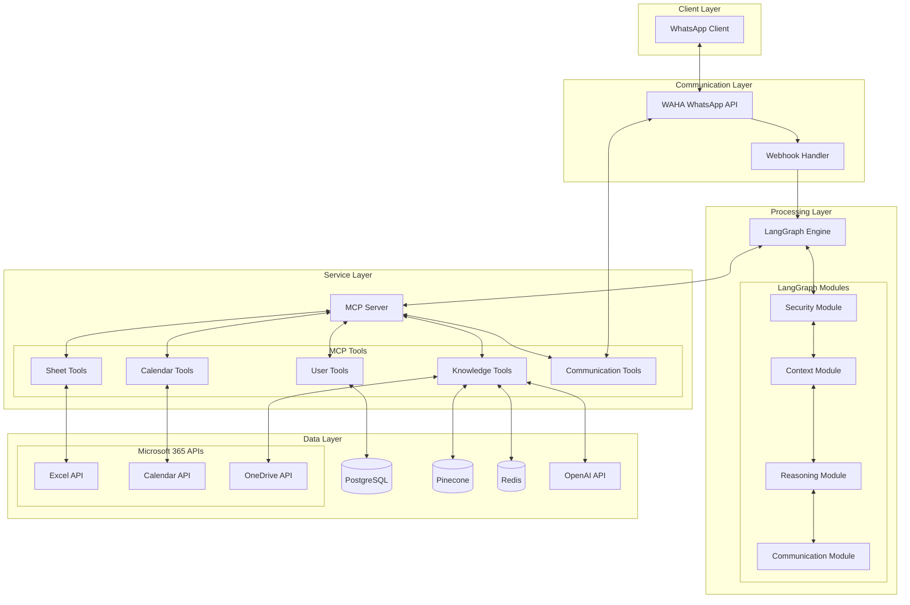
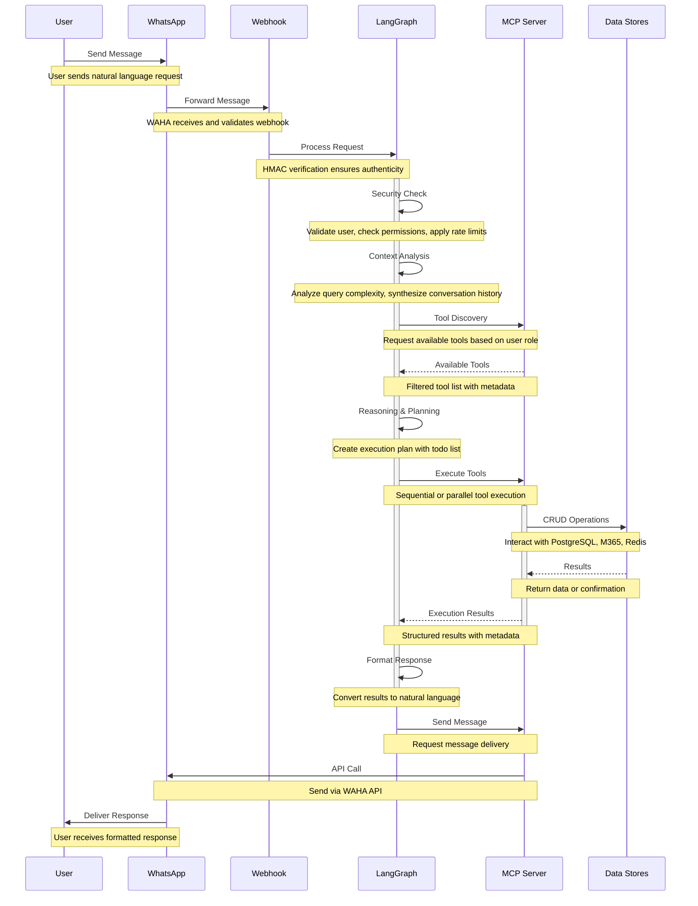
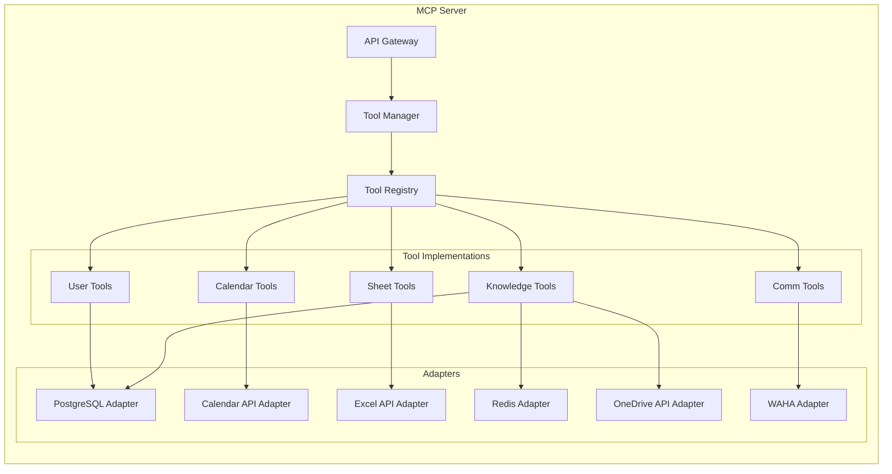
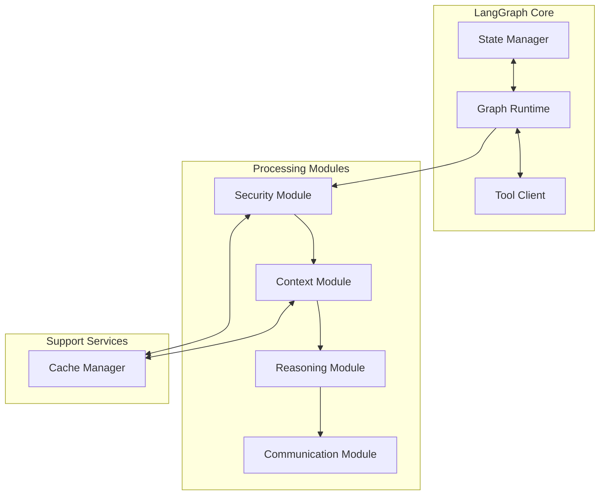
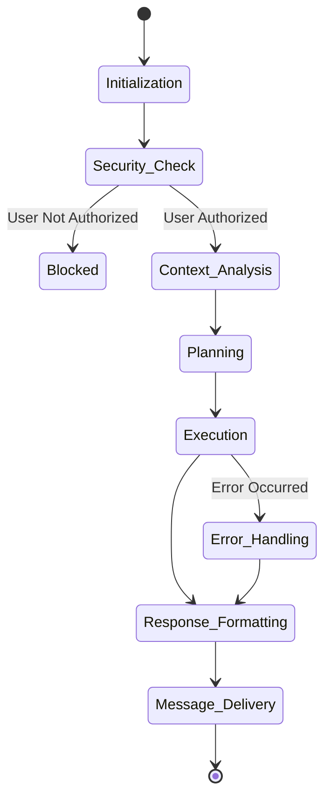
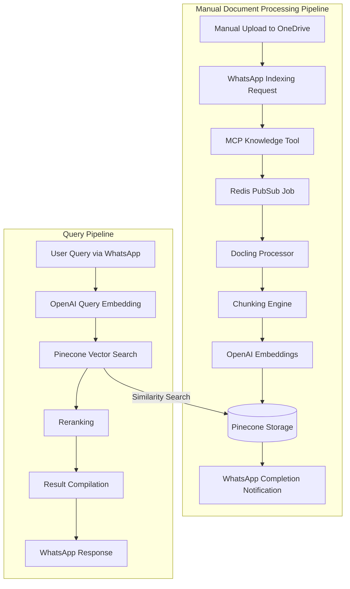
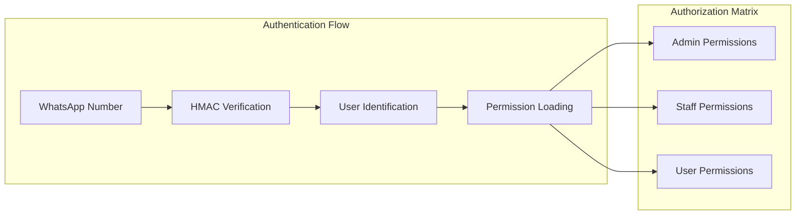
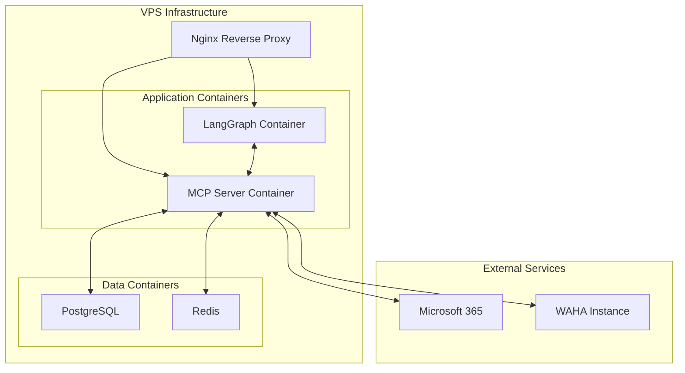

# AI Virtual Assistant Engineering Specification

## Table of Contents
1. [Executive Summary](#executive-summary)
2. [Background](#background)
3. [Goals and Objectives](#goals-and-objectives)
4. [System Architecture](#system-architecture)
5. [Component Specifications](#component-specifications)
6. [Security Architecture](#security-architecture)
7. [Deployment Strategy](#deployment-strategy)

---

## Executive Summary

This document outlines the engineering specification for an AI Virtual Assistant system that automates three core organizational functions through WhatsApp integration: calendar management, sheet-based helpdesk operations, and enterprise knowledge access.

The system leverages LangGraph for conversation orchestration and MCP (Model Context Protocol) for tool management, providing natural language automation for:
- **Calendar Automation**: Meeting scheduling, conflict resolution, and reminder notifications
- **Sheet Automation**: Spreadsheet-based helpdesk operations via Microsoft 365 Excel  
- **Knowledge Enterprise**: Company Q&A access with manual document indexing workflows

The assistant uses OpenAI for natural language processing, Pinecone for vector search, Microsoft 365 APIs for calendar and document integration, and Redis for async job processing. The modular architecture enables role-based access control and scales with organizational needs.

## Background

### Problem Statement
Organizations face inefficiencies in three critical operational areas:
- **Calendar Management**: Manual meeting scheduling leads to conflicts and coordination overhead
- **Helpdesk Operations**: Sheet-based tracking via traditional systems creates bottlenecks and delays
- **Knowledge Access**: Company information scattered across documents with poor searchability

### Solution Overview
An AI-powered virtual assistant accessible via WhatsApp that automates:
- **Calendar Operations**: Intelligent meeting scheduling with conflict resolution via Microsoft 365
- **Sheet System**: Helpdesk management through automated spreadsheet operations
- **Knowledge Base**: Enterprise Q&A with semantic search across company documents
- Maintains role-based security and integrates with existing Microsoft 365 infrastructure

### Technology Stack

Our technology stack is organized from communication to backend, showing the complete flow from user interaction to data storage:

#### Communication Layer  
- **WAHA (WhatsApp Business API)**: Message handling, delivery, and webhook management
- **Webhook Handler**: Request processing, validation, and routing

#### Processing & Service Layer
- **LangGraph Engine (Python)**: AI conversation orchestration and workflow management
- **MCP Server (Go)**: Tool execution, external integrations, and business logic
- **OpenAI API**: Natural language processing, reasoning, and text embeddings

#### Data Layer
- **Pinecone**: Vector database for semantic search and knowledge retrieval
- **PostgreSQL**: User management, authentication, and relational data storage
- **Redis**: Caching, pub/sub messaging, and session management
- **Microsoft 365 APIs**:
  - **Excel API**: Spreadsheet operations, data manipulation, and sheet management
  - **Calendar API**: Meeting scheduling, availability checking, and event management
  - **OneDrive API**: Document storage, retrieval, and knowledge base file access

#### Infrastructure Layer
- **Docker**: Application containerization and deployment
- **Nginx**: Reverse proxy and load balancing
- **VPS**: Virtual private server hosting
- **GitLab**: Source code repository and CI/CD pipeline automation
- **Sentry**: Error tracking and performance monitoring
- **Custom Domain**: Webhook endpoints and API access

## Goals and Objectives

### Primary Goals

1. **Calendar Automation**
   - Automate meeting scheduling, updates, and cancellations via WhatsApp
   - Handle conflict resolution and availability checking
   - Send configurable meeting reminders and notifications

2. **Sheet Automation (Helpdesk Management)**
   - Automate record creation, updates, and status tracking via spreadsheets
   - Enable data queries and reporting through natural language
   - Provide automated notifications and status updates

3. **Knowledge Enterprise**
   - Enable Q&A access to company knowledge base via WhatsApp
   - Process manual document uploads and trigger indexing workflows
   - Deliver contextual search results based on user permissions

### User Stories

#### Admin Role
- **User Management**: CRUD operations for users and role assignments via natural language
- **System Monitoring**: Query system metrics and performance data
- **Knowledge Administration**: Trigger document indexing after manual OneDrive uploads and manage access permissions

#### Staff Role
- **Calendar Management**: Full calendar CRUD operations via natural language interface
- **Sheet Management**: Create, update, and query helpdesk records with status tracking
- **Knowledge Queries**: Search organizational documents and procedures

#### User Role
- **User Onboarding**: Register and authenticate using phone number verification
- **Meeting Scheduling**: Create and manage personal calendar events
- **Notification System**: Receive sheet updates and configurable meeting reminders (default: 2 hours before)

## System Architecture

### High-Level Architecture

### Data Flow Sequence

The data flow through our system follows a carefully orchestrated sequence that ensures security, maintains context, and delivers intelligent responses. Each step in the flow serves a specific purpose in transforming a user's natural language input into actionable results.

#### Detailed Flow Analysis

1. **Message Reception and Validation**: When a user sends a message via WhatsApp, it first reaches the WAHA (WhatsApp HTTP API) service. WAHA handles the complexities of the WhatsApp Business API, including encryption, delivery receipts, and media handling. The webhook handler performs initial validation using HMAC signatures to ensure the request originates from a trusted source.

2. **Security Layer Processing**: Before any business logic executes, the security module validates the user's identity using their phone number as the primary identifier. It checks if the user is onboarded, retrieves their role-based permissions, and applies rate limiting to prevent abuse. Unauthorized users receive a friendly message guiding them through the onboarding process.

3. **Context Understanding**: The context module analyzes the incoming message within the conversation history. It uses a sliding window approach to maintain relevant context while managing memory efficiently. Query complexity analysis determines whether the request requires simple tool execution or complex multi-step reasoning.

4. **Tool Discovery and Filtering**: Based on the user's role and the query context, the system requests available tools from the MCP server. The server returns a filtered list of tools that the user has permission to access. This dynamic tool discovery allows the system to adapt as new capabilities are added without modifying the core logic.

5. **Intelligent Planning**: The reasoning module creates an execution plan, breaking complex requests into discrete steps. For example, \"Schedule a meeting with the sales team and share last month's revenue spreadsheet\" becomes a multi-step plan involving calendar checking, meeting creation, spreadsheet retrieval, and sharing.

6. **Tool Execution**: The MCP server executes tools according to the plan, handling errors gracefully and providing detailed feedback. Tools can be executed in parallel when there are no dependencies, improving response time. Each tool execution is logged for auditing and debugging purposes.

7. **Response Generation**: The communication module transforms structured tool outputs into natural, conversational responses. It considers the user's communication style, previous interactions, and the complexity of the results to generate appropriate responses. Long responses are automatically chunked to comply with WhatsApp message limits.

8. **Delivery and Confirmation**: The formatted response is sent back through the MCP server to WAHA, which handles the actual delivery to WhatsApp. Delivery receipts are tracked to ensure messages reach users, with retry logic for temporary failures.

## Component Specifications

This section provides detailed technical specifications for each major component in the system. Each component is designed with specific architectural principles in mind: high cohesion, loose coupling, clear interfaces, and operational excellence.

### MCP Server (Golang)

The MCP (Model Context Protocol) Server represents the heart of our tool execution layer. Written in Go for its excellent concurrency support and low-latency performance, the MCP Server provides a unified, standardized interface for all external integrations. This abstraction layer shields the AI orchestration logic from the complexities of various APIs, authentication mechanisms, and data formats.

The decision to implement the MCP Server in Go stems from several technical requirements:
- **Concurrent Tool Execution**: Go's goroutines and channels enable efficient parallel execution of independent tools
- **Low Memory Footprint**: Critical for scaling to thousands of concurrent users without excessive infrastructure costs
- **Strong Typing**: Reduces runtime errors and improves code maintainability
- **Excellent HTTP Performance**: Native HTTP server capabilities handle high request volumes efficiently
- **Simple Deployment**: Single binary compilation simplifies containerization and deployment

#### Architecture Design

The MCP Server follows a modular architecture with clear separation between the API layer, business logic, and external integrations. This design enables independent testing of components and allows for easy addition of new tools without affecting existing functionality.

#### Tool Specifications

Each tool in the MCP Server is designed as a self-contained module with clearly defined inputs, outputs, and side effects. Tools are categorized as either "static" (core functionality that rarely changes) or "dynamic" (functionality that may need frequent updates or has external dependencies).

##### User Management Tools

User management forms the foundation of our security and personalization features. These tools handle the complete user lifecycle from onboarding through deactivation, maintaining data integrity and security throughout.

**Core Capabilities:**
- **User Creation:** Onboards new users with phone number verification, email validation, and role assignment
- **User Retrieval:** Flexible lookup by phone number, email, or user ID with optional permission details
- **User Updates:** Modify user attributes with comprehensive audit trails and validation
- **User Deactivation:** Soft deletion with resource reassignment and session revocation

**Key Features:**
- Phone number uniqueness validation with international format support
- Email domain whitelisting for corporate security
- Role-based permission system with admin approval for privilege changes
- Comprehensive audit logging for all user modifications
- Encrypted storage for personally identifiable information

##### Calendar Management Tools

Calendar integration provides sophisticated meeting management capabilities that understand natural language requests and handle complex scheduling scenarios. The system integrates seamlessly with Microsoft 365 Calendar, maintaining compatibility with existing organizational workflows.

**Core Operations:**
- **Meeting Creation:** Intelligent conflict resolution with automatic time zone detection and optimal slot finding
- **Meeting Updates:** Change management with automatic attendee notifications and conflict checking
- **Meeting Cancellation:** Proper notification handling with meeting room release and material archival
- **Event Retrieval:** Smart filtering and sorting with detailed information on demand
- **Availability Finding:** Multi-attendee availability analysis with meeting room capacity consideration

**Intelligent Features:**
- Automatic time zone detection from user profiles
- Optimal time slot suggestions for all attendees
- Meeting room booking based on capacity requirements
- Alternative time suggestions when conflicts occur
- Recurring event management with series-wide operations

**Microsoft 365 Calendar API Integration:**
- Direct integration with Outlook Calendar via Microsoft Graph API
- Preservation of existing meeting features and formatting
- Support for Teams meeting links and virtual meeting rooms
- Synchronization with mobile and desktop Outlook clients

##### Sheet Management Tools

Spreadsheet integration transforms complex Excel operations into simple conversational requests. Users can query data, update values, and generate reports without understanding Excel formulas or navigation. The system maintains full compatibility with Microsoft 365 Excel while adding intelligent features.

**Core Operations:**
- **Sheet Creation:** Create new spreadsheets with pre-built templates (budget tracker, project timeline, inventory management, sales reports)
- **Data Retrieval:** Intelligent parsing with automatic header detection, data type recognition, and formatting preservation
- **Data Updates:** Bulk operations with formula validation, audit trails, and automatic data type conversion
- **Natural Language Queries:** Ask questions like "What's the total revenue for Q3?" or "Show me expenses over $1000"
- **Sheet Discovery:** Find and list spreadsheets with smart filtering and search capabilities

**Intelligent Features:**
- Natural language to spreadsheet query translation
- Automatic aggregations, filtering, and statistical analysis
- Smart suggestions for data visualization and charts
- Formula validation and error prevention
- Real-time collaborative editing support

**Microsoft 365 Excel API Integration:**
- Direct integration with Excel Online and desktop Excel via Microsoft Graph API
- Support for complex formulas, pivot tables, and macros
- Automatic synchronization across all Microsoft 365 applications
- Preservation of existing formatting and validation rules

##### Knowledge Base Tools

The knowledge base system represents our most sophisticated tool, implementing state-of-the-art RAG (Retrieval-Augmented Generation) techniques. It transforms static documents into a dynamic, queryable knowledge graph that understands context, relationships, and semantic meaning.

**Core Operations:**
- **Manual Document Upload:** Users manually upload documents to OneDrive outside of WhatsApp interface
- **Indexing Trigger:** Users notify via WhatsApp when documents need to be indexed or updated
- **Document Processing:** MCP knowledge tools process documents with chunking and entity extraction
- **Semantic Search:** Context-aware search with multi-vector search and re-ranking
- **Completion Notification:** WhatsApp notification sent when indexing is complete

**Advanced Processing Pipeline:**
- Automatic document type and language detection
- Smart chunking with semantic boundary preservation (512-1024 tokens with 100 token overlap)
- Advanced text extraction using Docling with table understanding and image OCR
- Entity extraction and relationship graph building
- Multi-language support with automatic translation capabilities

**Search Capabilities:**
- Hybrid search combining semantic similarity and keyword matching
- Query understanding and expansion for better results
- Context-aware re-ranking using specialized cross-encoder models
- Permission-filtered results based on user access levels
- Intelligent result deduplication and highlighting

**Processing Workflow:**
1. Users manually upload documents to OneDrive
2. Users send WhatsApp message requesting indexing/update
3. MCP knowledge tool triggers document processing via OneDrive API
4. Redis pub/sub publishes indexing job to background worker
5. Documents processed: chunking, embedding via OpenAI, stored in Pinecone
6. WhatsApp notification sent when processing complete
7. Support for multiple document formats (PDF, Word, Excel, PowerPoint, text files)

### LangGraph Engine (Python)

The LangGraph Engine serves as the cognitive center of our virtual assistant, orchestrating complex conversation flows while maintaining state across interactions. Built on LangChain's LangGraph framework, it implements a directed graph architecture where nodes represent processing steps and edges define the flow of conversation state.

Our implementation leverages LangGraph's unique capabilities to handle multi-step reasoning, conditional branching, and long-running conversations that span multiple user interactions. Unlike traditional chatbots that treat each message independently, our system maintains rich conversational context, enabling sophisticated multi-turn interactions that feel natural and intelligent.

The choice of Python for the LangGraph Engine provides access to the mature AI/ML ecosystem while maintaining code readability and rapid development capabilities. The engine is designed to be horizontally scalable, with each conversation maintaining its own state graph that can be persisted and resumed across server restarts.

#### Module Architecture

The LangGraph Engine employs a modular architecture where each module represents a node in the conversation graph. This design enables clear separation of concerns, independent testing, and the ability to modify conversation flows without affecting core logic.

#### Module Specifications

##### Security Module
The Security Module serves as the first line of defense for every user interaction. It validates user identity through phone number verification, checks role-based permissions, and applies configurable rate limiting to prevent abuse. The module implements HMAC signature verification to ensure webhook authenticity and maintains comprehensive audit logs for all security events.

Key responsibilities include user validation, permission filtering based on roles, rate limit enforcement, and webhook authentication. The module integrates with the user management system to retrieve current permissions and can dynamically adjust rate limits based on user behavior patterns.

##### Context Module
The Context Module manages the conversational state and memory that makes our assistant feel intelligent and aware. It analyzes incoming queries to determine complexity levels, synthesizes conversation history into meaningful context summaries, and extracts relevant entities like dates, names, and locations.

This module implements a sliding window approach to conversation history, ensuring relevant context is maintained while managing memory efficiently. It handles query complexity analysis to route simple requests through fast paths while ensuring complex multi-step requests receive appropriate processing resources.

##### Reasoning Module
The Reasoning Module represents the cognitive center of our assistant, transforming user intents into executable plans. It creates detailed execution plans that break complex requests into manageable steps, handles tool selection based on available capabilities, and manages parallel execution when possible.

The module excels at handling ambiguous queries by generating clarification requests and can optimize execution plans for better performance. It maintains a sophisticated understanding of tool dependencies and can adapt plans based on intermediate results or errors.

##### Communication Module
The Communication Module transforms structured data and results into natural, conversational responses. It formats responses based on user preferences, chunks long messages to comply with WhatsApp limits, and adds contextual quick reply suggestions to enhance user experience.

The module handles proactive notifications, manages response personalization, and ensures consistent communication style across all interactions. It can adapt its communication style based on user behavior patterns and interaction history.

#### State Management

### Knowledge Base Architecture

## Security Architecture

Security is not an afterthought but a fundamental design principle woven throughout our architecture. Our multi-layered security approach ensures data protection, user privacy, and system integrity while maintaining the conversational ease that makes the system accessible. We implement defense-in-depth strategies, assuming breach at every layer and implementing compensating controls.

### Authentication & Authorization

Our authentication system leverages WhatsApp's inherent phone number verification as the primary authentication factor, eliminating passwords while maintaining security. This approach reduces phishing risks and provides a seamless user experience. The authorization layer implements fine-grained, role-based access control that adapts dynamically based on user context and request patterns.

### Security Measures

Our security implementation follows industry best practices while adapting to the unique requirements of a conversational AI system. Each security measure is carefully balanced against usability to ensure protection without hindering legitimate use.

#### 1. HMAC Authentication

HMAC (Hash-based Message Authentication Code) provides cryptographic assurance that webhook requests originate from trusted sources. This prevents unauthorized systems from injecting commands or accessing user data.

**Implementation Details:**
- **Unique Secret Keys**: Each webhook endpoint maintains its own 256-bit secret key, stored in a secure key management system
- **Request Signing**: Every incoming request includes an HMAC-SHA256 signature computed over the request body and timestamp
- **Signature Verification**: The receiving service recomputes the signature and compares it with the provided signature
- **Timestamp Window**: Requests older than 5 minutes are rejected to prevent replay attacks
- **Key Rotation**: Automatic key rotation every 90 days with graceful transition periods

**Security Benefits:**
- Prevents man-in-the-middle attacks
- Ensures message integrity
- Provides non-repudiation
- Enables audit trails

#### 2. Advanced Rate Limiting

Our rate limiting system goes beyond simple request counting, implementing intelligent throttling that adapts to usage patterns while preventing abuse.

**Multi-Level Rate Limiting:**
- **Per-User Limits**: Default 10 requests per second, burstable to 20 for 10 seconds
- **Per-Endpoint Limits**: Different limits for read vs. write operations
- **Global Limits**: System-wide protection against DDoS attacks
- **Adaptive Throttling**: Automatically adjusts based on system load

**Implementation Features:**
- **Token Bucket Algorithm**: Allows burst traffic while maintaining average rates
- **Distributed Rate Limiting**: Synchronized across all service instances using Redis
- **Graceful Degradation**: Returns helpful error messages with retry-after headers
- **Whitelist Support**: Trusted services can have elevated limits
- **Analytics Integration**: Rate limit violations trigger security alerts

#### 3. Comprehensive Data Protection

Data protection encompasses encryption, access control, and privacy measures throughout the data lifecycle.

**Encryption Strategy:**
- **In Transit**: TLS 1.3 for all external communications with perfect forward secrecy
- **At Rest**: AES-256-GCM encryption for database fields containing PII
- **Key Management**: Hardware Security Module (HSM) for key generation and storage
- **Field-Level Encryption**: Selective encryption for sensitive fields while maintaining searchability

**Privacy Measures:**
- **Data Minimization**: Only collect necessary information
- **Pseudonymization**: Replace identifiers with pseudonyms where possible
- **Right to Erasure**: Automated data deletion workflows
- **Audit Logging**: Comprehensive logs of all data access

#### 4. Dynamic Access Control
**Role-Based Access Control:**
- **Admin:** Full system access including user management, system configuration, and all tool operations
- **Staff:** Complete access to calendar management, spreadsheet operations, and knowledge base including indexing capabilities
- **User:** Limited access focused on self-service operations including onboarding, personal calendar management, read-only spreadsheet access, and knowledge base queries

## Deployment Strategy

Our deployment strategy emphasizes operational simplicity, reliability, and cost-effectiveness. By choosing a VPS-based deployment over complex orchestration platforms, we maintain full control while reducing operational overhead. The containerized architecture ensures consistency across environments while enabling easy scaling when needed.

The deployment approach follows the principle of "boring technology" - using well-understood, battle-tested components that operations teams can manage confidently. This reduces the learning curve and ensures that the system can be maintained by a broad range of technical staff.

### Infrastructure Architecture

The infrastructure design balances performance requirements with operational simplicity. Each component runs in its own container, enabling independent scaling and updates while maintaining clear service boundaries.

### CI/CD Pipeline

**GitLab Pipeline:**
- Source code repository and CI/CD automation via GitLab
- Docker image builds for LangGraph (Python) and MCP Server (Go)
- Automated testing and security scanning
- VPS deployment using Docker containers

**Pipeline Stages:**
1. **Build:** Create Docker images with proper versioning
2. **Test:** Run unit tests and security scans
3. **Deploy:** Push images to VPS and restart containers
4. **Verify:** Health checks and smoke tests

### Monitoring & Observability

1. **Application Metrics**
   - Request latency percentiles (p50, p95, p99)
   - Tool execution times
   - Error rates by module

2. **System Metrics**
   - CPU and memory utilization
   - Database connection pools
   - Queue depths

3. **Business Metrics**
   - Active users
   - Message volume
   - Tool usage statistics

## Appendix

### Glossary

- **MCP**: Model Context Protocol - Standard for AI tool communication and execution
- **LangGraph**: Python framework for stateful AI conversation flows with directed graphs
- **WAHA**: WhatsApp HTTP API - Bridge service for WhatsApp Business integration
- **RAG**: Retrieval-Augmented Generation - AI combining language models with external knowledge
- **Docling**: Document processing library for chunking and text extraction
- **Pinecone**: Managed vector database for semantic search and embeddings
- **Redis Pub/Sub**: Messaging system for real-time communication and job processing
- **HMAC**: Hash-based authentication ensuring message integrity and authenticity
- **RBAC**: Role-Based Access Control - Permission system based on organizational roles
- **Webhook**: HTTP callback mechanism for real-time event notifications

### References

1. **LangGraph Documentation**: https://github.com/langchain-ai/langgraph
2. **MCP Specification**: https://modelcontextprotocol.io
3. **WAHA API Reference**: https://waha.devlike.pro
4. **Microsoft Graph API**: https://docs.microsoft.com/en-us/graph/
5. **Pinecone Documentation**: https://www.pinecone.io/docs/
6. **OpenAI API Documentation**: https://platform.openai.com/docs
7. **Docker Documentation**: https://docs.docker.com/
8. **PostgreSQL Documentation**: https://www.postgresql.org/docs/
9. **Redis Documentation**: https://redis.io/documentation
10. **Go Documentation**: https://golang.org/doc/