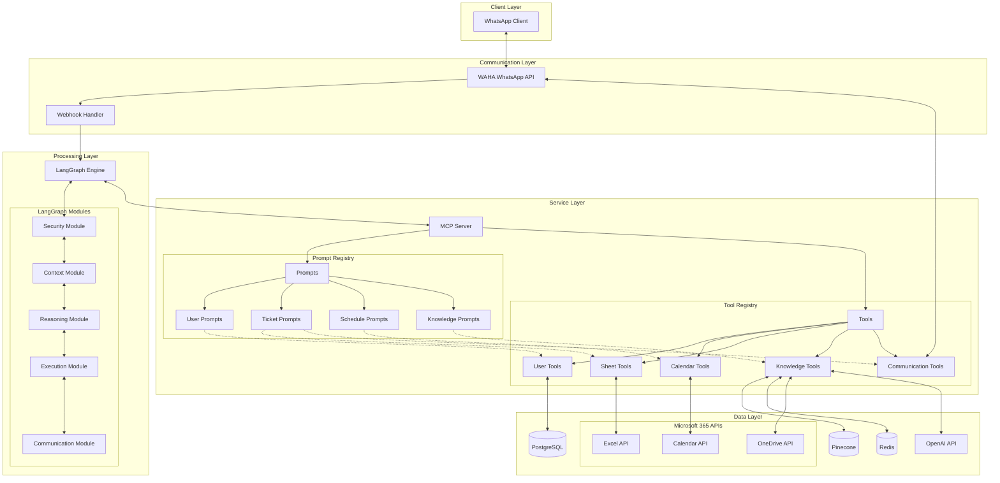
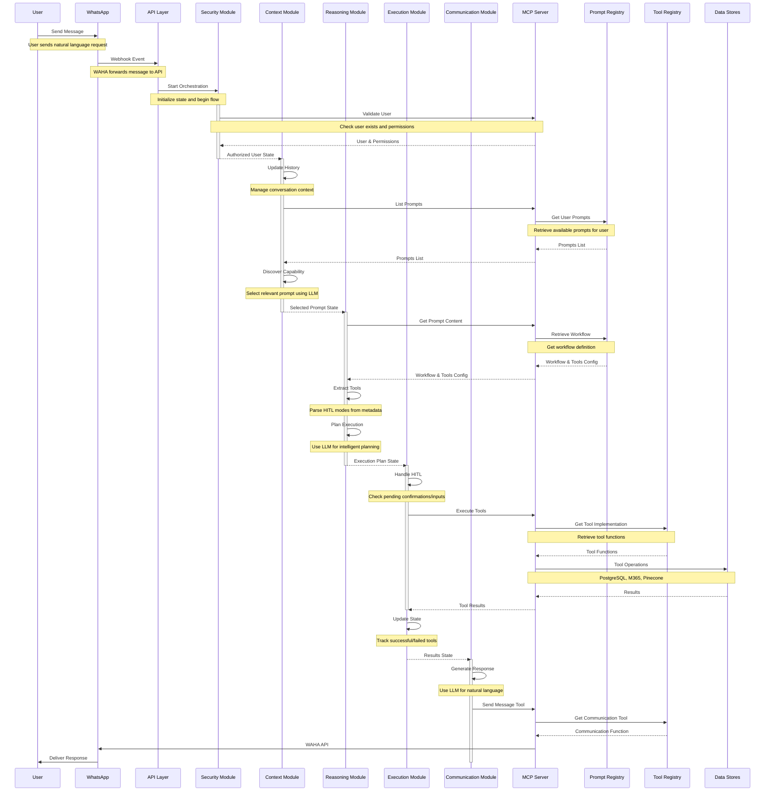
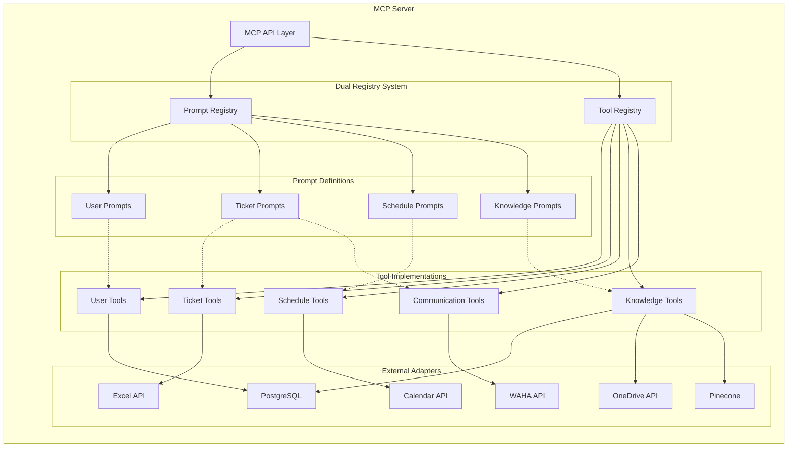
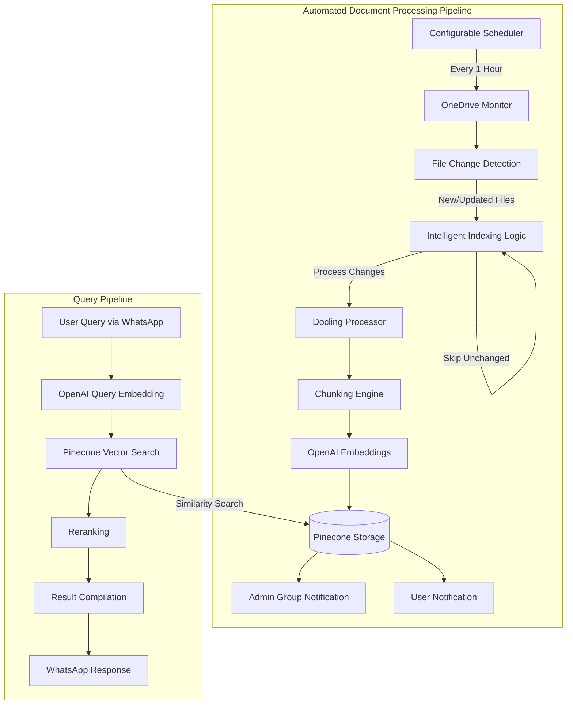
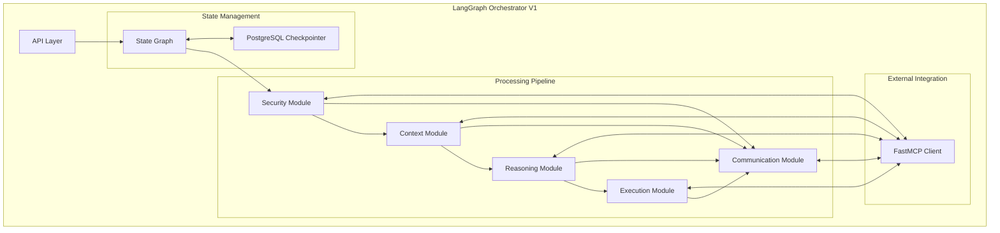
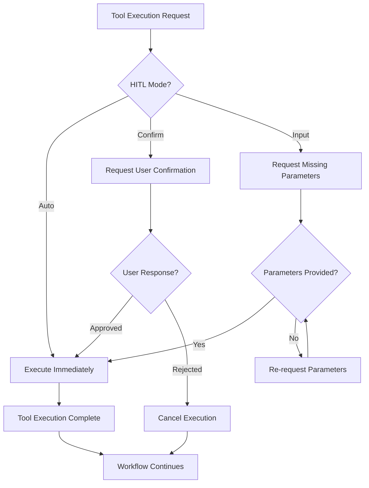
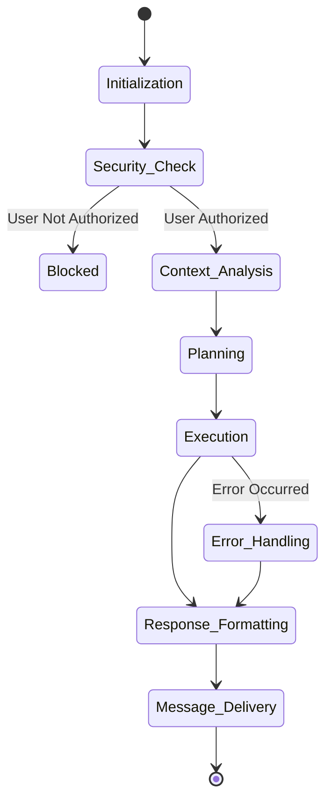
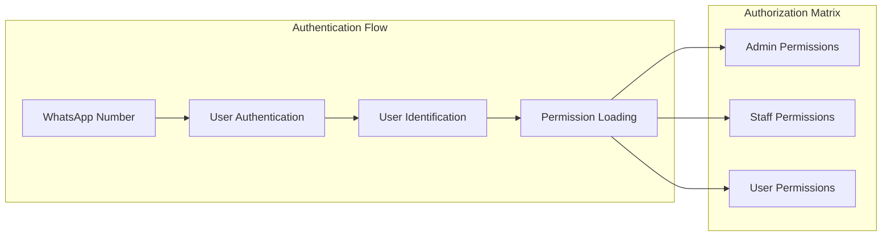
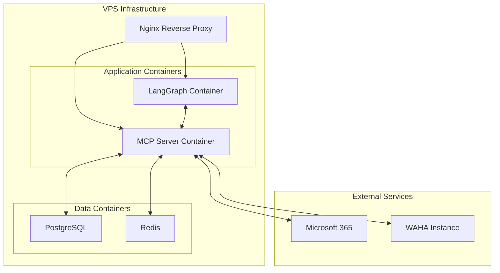

# AI Virtual Assistant Engineering Specification

## Table of Contents
1. [Executive Summary](#executive-summary)
2. [Background](#background)
   - 2.1 [Problem Statement](#problem-statement)
   - 2.2 [Solution Overview](#solution-overview)
3. [User Stories](#user-stories)
   - 3.1 [Admin Role](#admin-role)
   - 3.2 [Staff Role](#staff-role)
   - 3.3 [User Role](#user-role)
4. [Technology Stack](#technology-stack)
   - 4.1 [Communication Layer](#communication-layer)
   - 4.2 [Processing & Service Layer](#processing--service-layer)
   - 4.3 [Data Layer](#data-layer)
   - 4.4 [Infrastructure Layer](#infrastructure-layer)
5. [System Architecture](#system-architecture)
   - 5.1 [High-Level Architecture](#high-level-architecture)
   - 5.2 [Data Flow Sequence](#data-flow-sequence)
      - 5.2.1 [Detailed Flow Analysis](#detailed-flow-analysis)
6. [Component Specifications](#component-specifications)
   - 6.1 [MCP Server (Golang)](#mcp-server-golang)
      - 6.1.1 [Architecture](#architecture)
      - 6.1.2 [Tool Specifications](#tool-specifications)
         - 6.1.2.1 [User Management Tools](#user-management-tools)
         - 6.1.2.2 [Calendar Management Tools](#calendar-management-tools)
         - 6.1.2.3 [Sheet Management Tools](#sheet-management-tools)
         - 6.1.2.4 [Knowledge Base Tools](#knowledge-base-tools)
      - 6.1.3 [Knowledge Base](#knowledge-base)
   - 6.2 [LangGraph Engine (Python)](#langgraph-engine-python)
      - 6.2.1 [Architecture](#architecture-1)
      - 6.2.2 [Module Specifications](#module-specifications)
         - 6.2.2.1 [Security Module](#security-module)
         - 6.2.2.2 [Context Module](#context-module)
         - 6.2.2.3 [Reasoning Module](#reasoning-module)
         - 6.2.2.4 [Communication Module](#communication-module)
      - 6.2.3 [State Management](#state-management)
7. [Security Architecture](#security-architecture)
   - 7.1 [Authentication & Authorization](#authentication--authorization)
   - 7.2 [Security Measures](#security-measures)
      - 7.2.1 [Authentication Security](#1-authentication-security)
      - 7.2.2 [Dynamic Access Control](#2-dynamic-access-control)
8. [Deployment Strategy](#deployment-strategy)
   - 8.1 [Infrastructure Architecture](#infrastructure-architecture)
   - 8.2 [CI/CD Pipeline](#cicd-pipeline)
9. [Appendix](#appendix)
   - 9.1 [Glossary](#glossary)
   - 9.2 [References](#references)

---

## Executive Summary

This document defines the engineering specification for an AI Virtual Assistant system that provides intelligent workflow automation through WhatsApp integration. The system orchestrates complex workflows through conversational interfaces, enabling natural language automation across organizational functions.

The architecture leverages:
- **MCP (Model Context Protocol)**: Defines prompts as intelligent workflows and tools as executable functions with HITL (Human-in-the-Loop) configurations
- **LangGraph Engine**: Orchestrates conversation flow through five specialized modules (Security, Context, Reasoning, Execution, Communication)
- **Workflow Intelligence**: Each prompt contains step-by-step workflow definitions with associated tools that can operate in auto, confirm, or input modes

Key capabilities include:
- **Calendar Management**: Intelligent meeting scheduling with natural language understanding
- **Ticket Management**: Automated helpdesk operations with workflow-based ticket handling
- **Knowledge Access**: Semantic search across enterprise documents with automated indexing
- **User Management**: Role-based access control with dynamic permission management

The system uses OpenAI for reasoning and response generation, PostgreSQL for state persistence, Microsoft 365 APIs for productivity integration, and Pinecone for vector search. The modular architecture enables workflow extensibility while maintaining security and user experience.

## Background

### Problem Statement
Organizations experience inefficiencies in three operational areas:
- **Calendar Management**: Manual meeting scheduling leads to manual efforts & miss schedule
- **Helpdesk Operations**: Sheet-based tracking via traditional systems creates bottlenecks and delays
- **Knowledge Access**: Company information scattered across documents with poor searchability

### Solution Overview
An AI virtual assistant accessible via WhatsApp that automates:
- **Calendar Automation**:  Meeting scheduling and reminder notifications
- **Sheet Automation**: Spreadsheet-based helpdesk automated operation
- **Knowledge Enterprise**: Enterprise Q&A with semantic search across company documents

## User Stories

### Admin Role
- **User Management**: CRUD operations for users and role assignments via natural language
- **Sheet Automation**: Query & update helpdesk records with status tracking
- **Knowledge Enterprise**: Manage access permissions with automated document processing

### User Role
- **Onboarding**: Register and authenticate using email verification
- **Calendar Automation**: Create and manage personal calendar events
- **Sheet Automation**: Create & query personal ticket records
- **Knowledge Enterprise**: QnA based on organizational documents and procedures
- **Notification System**: Receive sheet updates and configurable meeting reminders (default: 1 hour before)

## Technology Stack

The technology stack is organized from communication to backend, showing the complete flow from user interaction to data storage:

### Communication Layer  
- **WAHA (WhatsApp Business API)**: Message handling, delivery, and webhook management
- **Webhook Handler**: Request processing, validation, and routing

### Processing & Service Layer
- **LangGraph Engine (Python)**: AI conversation orchestration and workflow management
- **MCP Server (Go)**: Tool execution, external integrations, and business logic
- **OpenAI API**: Natural language processing, reasoning, and text embeddings

### Data Layer
- **Pinecone**: Vector database for semantic search and knowledge retrieval
- **PostgreSQL**: User management, authentication, and relational data storage
- **Redis**: Caching, pub/sub messaging, and session management
- **Microsoft 365 APIs**:
  - **Excel API**: Spreadsheet operations, data manipulation, and sheet management
  - **Calendar API**: Meeting scheduling, availability checking, and event management
  - **OneDrive API**: Document storage, retrieval, and knowledge base file access

### Infrastructure Layer
- **Docker**: Application containerization and deployment
- **Nginx**: Reverse proxy and load balancing
- **VPS**: Virtual private server hosting
- **GitLab**: Source code repository and CI/CD pipeline automation
- **Custom Domain**: Webhook endpoints and API access

## System Architecture

### High-Level Architecture

### Data Flow Sequence

The data flow follows a modular orchestration pattern where each node in the LangGraph engine processes specific aspects of the conversation. The flow ensures security validation, intelligent context analysis, workflow-based reasoning, tool execution with HITL support, and natural response generation.

#### Detailed Flow Analysis

1. **Message Reception**: When a user sends a message via WhatsApp, WAHA (WhatsApp HTTP API) receives it and forwards to the API layer through webhooks. The API layer initializes the orchestration state and begins the LangGraph flow.

2. **Security Module**: The first node validates user identity through the MCP server, checking if the user exists and retrieving their permissions (allowed tools and prompts). This creates a security boundary ensuring only authorized users can proceed.

3. **Context Module**: Analyzes the message within conversation history, maintaining state through PostgreSQL checkpointing. It discovers available prompts from MCP based on user permissions, then uses an LLM to select the most relevant prompt for the user's intent.

4. **Reasoning Module**: Retrieves the selected prompt's workflow definition from MCP, which includes the workflow intelligence and tool configurations with HITL modes. It extracts tools from the prompt metadata and uses an LLM to create an intelligent execution plan.

5. **Execution Module**: Handles pending tools requiring human interaction (confirmations or inputs), then executes tools via MCP based on their HITL configuration:
   - **Auto mode**: Executes immediately without user interaction
   - **Confirm mode**: Requests user confirmation before execution
   - **Input mode**: Asks user for missing parameters
   The module tracks successful and failed tools to support workflow continuation.

6. **Communication Module**: Generates natural language responses using an LLM based on the execution results and conversation context. It sends the response through MCP's communication tool, which delivers it via WAHA to the user.

7. **State Persistence**: Throughout the flow, LangGraph maintains conversation state using PostgreSQL checkpointing, enabling workflows to pause for user input and resume seamlessly across multiple messages.

8. **Workflow Continuation**: The system supports complex multi-step workflows that can span multiple user interactions, with intelligent handling of partial completions and error recovery.

## Component Specifications

This section provides detailed technical specifications for each major component. Each component follows architectural principles: high cohesion, loose coupling, clear interfaces, and operational excellence.

### MCP Server (Golang)

The MCP (Model Context Protocol) Server manages two primary components: prompts (intelligent workflows) and tools (executable functions). Written in Go for concurrency and performance, the MCP Server provides a unified interface for workflow definitions and business logic execution. This architecture separates conversation intelligence (prompts) from functional implementation (tools), enabling flexible workflow composition and tool reuse.

#### Architecture

The MCP Server follows a dual-registry architecture where prompts and tools are managed independently. Prompts define workflow intelligence and specify which tools they can use with HITL configurations. Tools implement business logic and can be composed into different workflows through prompt definitions. This separation enables workflow reusability and tool modularity.

#### Prompt and Tool Specifications

The MCP Server implements a two-layer architecture:

**Prompts** define intelligent workflows with step-by-step flow definitions, interaction patterns, and tool configurations. Each prompt specifies which tools it can use and their HITL (Human-in-the-Loop) modes:
- **Auto**: Tool executes automatically without user interaction
- **Confirm**: Tool requests user confirmation before execution  
- **Input**: Tool requires additional user input for missing parameters

**Tools** are type-safe, self-contained modules that implement business logic. Each tool defines structured inputs/outputs with JSON schema validation and standardized error handling.

##### User Management Tools

User management provides the foundation for security and personalization features. These tools handle the complete user lifecycle from onboarding through deactivation, maintaining data integrity and security.

Core Capabilities:
- **User Create:** Onboards new users with phone number verification, email validation, and role assignment
- **User Read:** Flexible lookup by phone number, email, or user ID with optional permission details
- **User Update:** Modify user attributes with comprehensive audit trails and validation

Key Features:
- Phone number uniqueness validation with international format support
- Email domain whitelisting for corporate security
- Role-based permission system with admin approval for privilege changes

##### Calendar Management Tools

Calendar integration provides meeting management capabilities that process natural language requests and handle scheduling scenarios. The system integrates with Microsoft 365 Calendar, maintaining compatibility with existing organizational workflows.

Core Operations:
- **Meeting Create:** Intelligent meeting creation for their own email
- **Meeting Read:** Smart filtering for their own email
- **Meeting Update:** Change meeting for their own email
- **Meeting Delete:** Cancel meeting for their own email

##### Sheet Management Tools

Spreadsheet integration converts complex Excel operations into conversational requests. Users can query data, update values, and generate reports without understanding Excel formulas or navigation. The system maintains compatibility with Microsoft 365 Excel while adding features.

Core Operations:
- **Sheet Create:** Insert ticket rows
- **Sheet Read:** Get ticket based on code
- **Sheet Update:** Update ticket status
- **Sheet Delete:** Update ticket status

##### Communication Tools

Communication used as interface to send comms to various, in our case for now we will send to whatsapp via WAHA.

Core Operations:
- **Send to Group:** Sent to user
- **Send to User:** Sent to group

##### Knowledge Base Tools

The knowledge base system implements RAG (Retrieval-Augmented Generation) techniques with automated scheduler-based indexing. It transforms static documents into a queryable knowledge graph that processes context, relationships, and semantic meaning through intelligent monitoring and processing.

Core Operations:
- **Automated Document Monitoring:** Continuous monitoring of OneDrive for document changes via application-level configurable scheduler (default: 1 hour intervals, requires redeployment to modify)
- **Intelligent Indexing:** Smart processing that upserts updated documents, indexes new documents, and skips unchanged documents for optimal performance
- **Document Processing:** MCP knowledge tools process documents with chunking and entity extraction
- **Semantic Search:** Context-aware search with multi-vector search and re-ranking
- **Admin Notifications:** Group WhatsApp notifications for indexing completion and new incoming tickets

#### Knowledge Base

The knowledge base system implements a comprehensive document processing and retrieval pipeline that transforms static organizational documents into an intelligent, queryable knowledge repository. This system bridges the gap between unstructured company information and instant, contextual answers through WhatsApp.

The implementation follows an automated three-phase approach: continuous monitoring, intelligent indexing, and query processing. The scheduler-based monitoring continuously scans OneDrive for document changes at application-level configurable intervals (default: 1 hour, requires redeployment to modify). During intelligent indexing, only modified or new documents are processed through advanced NLP techniques including intelligent chunking, entity extraction, and semantic embedding, while unchanged documents are skipped to optimize performance. The query phase leverages vector similarity search combined with re-ranking algorithms to deliver accurate, context-aware responses.

### LangGraph Engine (Python)

The LangGraph Engine serves as the conversation orchestrator, implementing a five-module pipeline that processes user messages through specialized nodes. Built on LangChain's LangGraph framework, it uses a directed state graph where each module performs specific cognitive functions while maintaining conversation state.

The orchestrator v1 implements sequential processing through Security → Context → Reasoning → Execution → Communication modules, with each node making intelligent routing decisions based on the conversation state. The engine integrates with MCP servers to discover prompts (workflows) and execute tools with HITL support.

Python provides optimal integration with the AI/ML ecosystem, while LangGraph's state management enables conversation persistence through PostgreSQL checkpointing. This allows complex workflows to pause for user input and resume seamlessly across multiple interactions.

#### Architecture

The LangGraph Engine implements a sequential node architecture where each module specializes in a specific aspect of conversation processing. The state flows linearly through the modules, with each node making routing decisions based on processing results and conversation context.

#### Module Specifications

##### Security Module
The Security Module validates user identity and permissions through MCP integration. It checks if users exist in the system and retrieves their role-based permissions for both tools and prompts. The module creates a security boundary ensuring only authorized users can proceed to context analysis.

Key responsibilities include user validation via MCP server, permission retrieval (allowed tools and prompts), and routing decisions based on authorization status. Unauthorized users are routed directly to the communication module for onboarding guidance.

##### Context Module
The Context Module manages conversation history and discovers the most relevant workflow for user requests. It updates conversation state, maintains context through PostgreSQL checkpointing, and uses an LLM-based capability discovery strategy to select appropriate prompts from MCP.

The module retrieves available prompts based on user permissions, analyzes the user message against prompt descriptions, and selects the most relevant workflow. It handles query relevance analysis to route messages to reasoning for workflow execution or directly to communication for general responses.

##### Reasoning Module
The Reasoning Module retrieves workflow definitions from MCP and uses LLM-based analysis to create intelligent execution plans. It extracts tools from prompt metadata, parses HITL configurations, and builds comprehensive execution strategies that consider tool dependencies and user interaction requirements.

The module uses a workflow analyzer to parse prompt content and extract tool configurations using pattern matching. It creates execution plans that track tool states (successful, failed, pending) and can adapt based on user inputs and tool execution results.

##### Execution Module
The Execution Module handles Human-in-the-Loop (HITL) interactions and executes tools via MCP based on their configured modes. It manages pending tools requiring user confirmations or inputs, extracts parameters using LLM analysis, and tracks workflow continuation across multiple user interactions.

The module supports three HITL modes: auto (immediate execution), confirm (user approval required), and input (additional parameters needed). It maintains execution state to support workflow resumption and handles error recovery for failed tool executions.

###### HITL Confirmation Flow for Auto Input

##### Communication Module
The Communication Module generates natural language responses using LLM-based response generation. It transforms structured tool results and conversation context into conversational responses, then sends messages through MCP's communication tools to deliver responses via WAHA to users.

The module handles response formatting, maintains conversational tone consistency, and ensures responses are appropriately contextual based on the conversation history and execution results.

#### State Management

The state management system maintains conversation context and flow control across the entire assistant lifecycle. Built on LangGraph's state graph architecture, it enables the assistant to remember previous interactions, track multi-step operations, and handle complex conversational flows that span multiple messages.

Each conversation maintains its own isolated state graph that persists across server restarts. The state transitions are deterministic, ensuring consistent behavior and enabling debugging of conversation flows. The system implements checkpointing at each state transition, allowing conversations to resume from any point and providing resilience against failures.

## Security Architecture

Security is a fundamental design principle throughout the architecture. The multi-layered security approach ensures data protection, user privacy, and system integrity while maintaining conversational accessibility. The implementation uses defense-in-depth strategies, assuming breach at every layer and implementing compensating controls.

### Authentication & Authorization

The authentication system uses WhatsApp's phone number verification as the primary authentication factor, eliminating passwords while maintaining security. This approach reduces phishing risks and provides seamless user experience. The authorization layer implements fine-grained, role-based access control that adapts dynamically based on user context and request patterns.

### Security Measures

The security implementation follows industry best practices while adapting to conversational AI system requirements. Each security measure balances protection against usability to ensure legitimate use is not hindered.

#### 1. Authentication Security

The authentication system uses WhatsApp's inherent phone number verification as the primary authentication mechanism. This approach leverages WhatsApp's own security infrastructure while providing seamless user experience without additional credentials.

Implementation Details:
- **Phone Number Identity**: Users are authenticated based on their verified WhatsApp phone numbers
- **MCP Integration**: Authentication validation occurs through the MCP server's user management tools
- **Session Management**: Conversation state is maintained through PostgreSQL checkpointing with secure session handling

#### 2. Dynamic Access Control
Role-Based Access Control:
- **Admin:** Full system access including user management, system configuration, and all tool operations
- **Staff:** Complete access to calendar management, spreadsheet operations, and knowledge base including indexing capabilities
- **User:** Limited access focused on self-service operations including onboarding, personal calendar management, read-only spreadsheet access, and knowledge base queries

## Deployment Strategy

The deployment strategy emphasizes operational simplicity, reliability, and cost-effectiveness. VPS-based deployment over complex orchestration platforms maintains control while reducing operational overhead. The containerized architecture ensures consistency across environments while enabling scaling when needed.

The deployment approach uses well-understood, battle-tested components that operations teams can manage confidently. This reduces the learning curve and ensures the system can be maintained by technical staff.

### Infrastructure Architecture

The infrastructure design balances performance requirements with operational simplicity. Each component runs in its own container, enabling independent scaling and updates while maintaining clear service boundaries.

### CI/CD Pipeline

GitLab Pipeline:
- Source code repository and CI/CD automation via GitLab
- Docker image builds for LangGraph (Python) and MCP Server (Go)
- Automated testing and security scanning
- VPS deployment using Docker containers

Pipeline Stages:
1. **Build:** Create Docker images with proper versioning
2. **Test:** Run unit tests and security scans
3. **Deploy:** Push images to VPS and restart containers
4. **Verify:** Health checks and smoke tests

## Appendix

### Glossary

- **MCP**: Model Context Protocol - Standard for AI tool communication and execution
- **LangGraph**: Python framework for stateful AI conversation flows with directed graphs
- **WAHA**: WhatsApp HTTP API - Bridge service for WhatsApp Business integration
- **RAG**: Retrieval-Augmented Generation - AI combining language models with external knowledge
- **Docling**: Document processing library for chunking and text extraction
- **Pinecone**: Managed vector database for semantic search and embeddings
- **Redis Pub/Sub**: Messaging system for real-time communication and job processing
- **Authentication**: Phone number-based authentication through WhatsApp verification
- **RBAC**: Role-Based Access Control - Permission system based on organizational roles
- **Webhook**: HTTP callback mechanism for real-time event notifications

### References

1. **LangGraph Documentation**: https://github.com/langchain-ai/langgraph
2. **MCP Specification**: https://modelcontextprotocol.io
3. **WAHA API Reference**: https://waha.devlike.pro
4. **Microsoft Graph API**: https://docs.microsoft.com/en-us/graph/
5. **Pinecone Documentation**: https://www.pinecone.io/docs/
6. **OpenAI API Documentation**: https://platform.openai.com/docs
7. **Docker Documentation**: https://docs.docker.com/
8. **PostgreSQL Documentation**: https://www.postgresql.org/docs/
9. **Redis Documentation**: https://redis.io/documentation
10. **Go Documentation**: https://golang.org/doc/